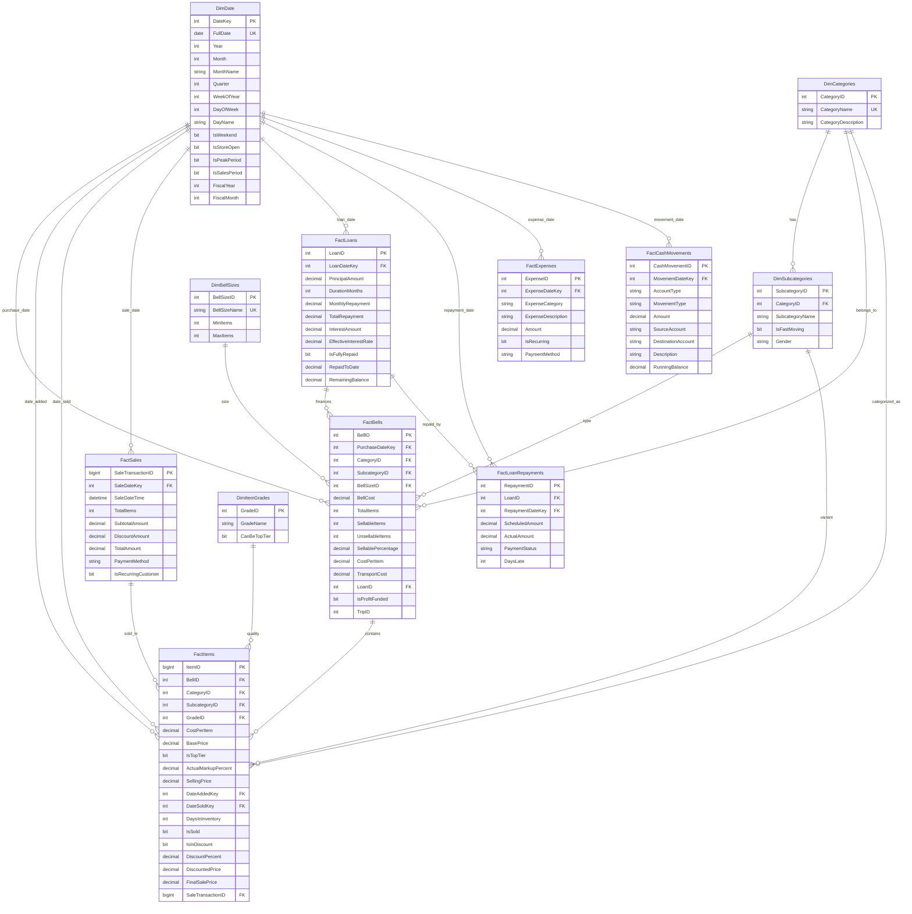

# Entity Relationship Diagram (ERD)

## Mermaid Diagram



## Text-Based ERD (Crow's Foot Notation)

```
═══════════════════════════════════════════════════════════════════════════
                        AMAZING GRACE STORE - ERD
                     Star Schema Data Warehouse Design
═══════════════════════════════════════════════════════════════════════════

DIMENSION TABLES (Reference Data)
═══════════════════════════════════════════════════════════════════════════

┌─────────────────────────────────────────────────────────────────────────┐
│ DimDate                                                    [366 rows]    │
├─────────────────────────────────────────────────────────────────────────┤
│ • DateKey (PK, INT)                    -- YYYYMMDD format              │
│   FullDate (UK, DATE)                  -- Actual calendar date         │
│   Year (INT)                           -- 2024                         │
│   Month (INT)                          -- 1-12                         │
│   MonthName (NVARCHAR)                 -- January, February, etc.      │
│   Quarter (INT)                        -- 1-4                          │
│   WeekOfYear (INT)                     -- 1-52                         │
│   DayOfWeek (INT)                      -- 1=Sunday, 7=Saturday         │
│   DayName (NVARCHAR)                   -- Monday, Tuesday, etc.        │
│   IsWeekend (BIT)                      -- Saturday/Sunday flag         │
│   IsStoreOpen (BIT)                    -- Operating day flag           │
│   IsPeakPeriod (BIT)                   -- High traffic periods         │
│   IsSalesPeriod (BIT)                  -- Discount periods             │
│   FiscalYear (INT)                     -- Fiscal calendar              │
│   FiscalMonth (INT)                    -- Fiscal month                 │
└─────────────────────────────────────────────────────────────────────────┘
                    │
                    ├──→ FactBells.PurchaseDateKey
                    ├──→ FactItems.DateAddedKey
                    ├──→ FactItems.DateSoldKey
                    ├──→ FactSales.SaleDateKey
                    ├──→ FactLoans.LoanDateKey
                    ├──→ FactLoanRepayments.RepaymentDateKey
                    ├──→ FactExpenses.ExpenseDateKey
                    └──→ FactCashMovements.MovementDateKey

┌─────────────────────────────────────────────────────────────────────────┐
│ DimCategories                                              [5 rows]     │
├─────────────────────────────────────────────────────────────────────────┤
│ • CategoryID (PK, INT, IDENTITY)                                       │
│   CategoryName (UK, NVARCHAR)          -- Tops, Bottoms, etc.          │
│   CategoryDescription (NVARCHAR)       -- Detailed description         │
└─────────────────────────────────────────────────────────────────────────┘
                    │
                    ├──→ DimSubcategories.CategoryID
                    ├──→ FactBells.CategoryID
                    └──→ FactItems.CategoryID

┌─────────────────────────────────────────────────────────────────────────┐
│ DimSubcategories                                          [47 rows]     │
├─────────────────────────────────────────────────────────────────────────┤
│ • SubcategoryID (PK, INT, IDENTITY)                                    │
│   CategoryID (FK → DimCategories)                                      │
│   SubcategoryName (NVARCHAR)           -- T-shirts, Jeans, etc.        │
│   IsFastMoving (BIT)                   -- High turnover flag           │
│   Gender (NVARCHAR)                    -- Male/Female/Both             │
│   UNIQUE(CategoryID, SubcategoryName)                                  │
└─────────────────────────────────────────────────────────────────────────┘
                    │
                    ├──→ FactBells.SubcategoryID
                    └──→ FactItems.SubcategoryID

┌─────────────────────────────────────────────────────────────────────────┐
│ DimBellSizes                                               [3 rows]     │
├─────────────────────────────────────────────────────────────────────────┤
│ • BellSizeID (PK, INT, IDENTITY)                                       │
│   BellSizeName (UK, NVARCHAR)          -- Small, Medium, Large         │
│   MinItems (INT)                       -- 200, 300, 400                │
│   MaxItems (INT)                       -- 250, 350, 500                │
│   CHECK: MaxItems > MinItems                                           │
└─────────────────────────────────────────────────────────────────────────┘
                    │
                    └──→ FactBells.BellSizeID

┌─────────────────────────────────────────────────────────────────────────┐
│ DimItemGrades                                              [2 rows]     │
├─────────────────────────────────────────────────────────────────────────┤
│ • GradeID (PK, INT)                    -- 1, 2 only                    │
│   GradeName (NVARCHAR)                 -- Grade 1, Grade 2             │
│   CanBeTopTier (BIT)                   -- Only Grade 1 eligible        │
│   CHECK: GradeID IN (1, 2)                                             │
└─────────────────────────────────────────────────────────────────────────┘
                    │
                    └──→ FactItems.GradeID


FACT TABLES (Transactional Data)
═══════════════════════════════════════════════════════════════════════════

┌─────────────────────────────────────────────────────────────────────────┐
│ FactLoans                                                  [~8 rows]    │
├─────────────────────────────────────────────────────────────────────────┤
│ • LoanID (PK, INT, IDENTITY)                                           │
│   LoanDateKey (FK → DimDate)                                           │
│   PrincipalAmount (DECIMAL)            -- ₦2M-₦8M                      │
│   DurationMonths (INT)                 -- 6 or 12 months               │
│   MonthlyRepayment (DECIMAL)           -- Calculated                   │
│   TotalRepayment (DECIMAL)             -- Principal + Interest         │
│   InterestAmount (DECIMAL)             -- Total interest               │
│   EffectiveInterestRate (DECIMAL)      -- 12-18% APR                   │
│   IsFullyRepaid (BIT)                  -- Completion status            │
│   RepaidToDate (DECIMAL)               -- Running total               │
│   RemainingBalance (DECIMAL)           -- Outstanding amount           │
│   CHECK: PrincipalAmount BETWEEN 2M AND 8M                             │
│   CHECK: DurationMonths IN (6, 12)                                     │
└─────────────────────────────────────────────────────────────────────────┘
                    │
                    ├──→ FactBells.LoanID
                    └──→ FactLoanRepayments.LoanID

┌─────────────────────────────────────────────────────────────────────────┐
│ FactLoanRepayments                                        [~70 rows]    │
├─────────────────────────────────────────────────────────────────────────┤
│ • RepaymentID (PK, INT, IDENTITY)                                      │
│   LoanID (FK → FactLoans)                                              │
│   RepaymentDateKey (FK → DimDate)                                      │
│   ScheduledAmount (DECIMAL)            -- Expected payment             │
│   ActualAmount (DECIMAL)               -- Actual payment               │
│   PaymentStatus (NVARCHAR)             -- OnTime/Late/Partial          │
│   DaysLate (INT, NULLABLE)             -- If late                      │
│   CHECK: PaymentStatus IN ('OnTime', 'Late', 'Partial')                │
└─────────────────────────────────────────────────────────────────────────┘

┌─────────────────────────────────────────────────────────────────────────┐
│ FactBells                                                 [~130 rows]   │
├─────────────────────────────────────────────────────────────────────────┤
│ • BellID (PK, INT, IDENTITY)                                           │
│   PurchaseDateKey (FK → DimDate)                                       │
│   CategoryID (FK → DimCategories)                                      │
│   SubcategoryID (FK → DimSubcategories)                                │
│   BellSizeID (FK → DimBellSizes)                                       │
│   BellCost (DECIMAL)                   -- ₦350K-₦850K                  │
│   TotalItems (INT)                     -- Total pieces in bell         │
│   SellableItems (INT)                  -- Quality items                │
│   UnsellableItems (INT)                -- Damaged/unusable             │
│   SellablePercentage (DECIMAL)         -- 65-90%                       │
│   CostPerItem (DECIMAL)                -- BellCost/SellableItems       │
│   TransportCost (DECIMAL)              -- ₦12K per trip (shared)       │
│   LoanID (FK → FactLoans, NULLABLE)    -- If loan-funded              │
│   IsProfitFunded (BIT)                 -- Loan vs Profit source       │
│   TripID (INT)                         -- Grouping for transport      │
│   CHECK: BellCost BETWEEN 350K AND 850K                                │
│   CHECK: TotalItems = SellableItems + UnsellableItems                  │
└─────────────────────────────────────────────────────────────────────────┘
                    │
                    └──→ FactItems.BellID

┌─────────────────────────────────────────────────────────────────────────┐
│ FactItems                                              [~36,000 rows]   │
├─────────────────────────────────────────────────────────────────────────┤
│ • ItemID (PK, BIGINT, IDENTITY)                                        │
│   BellID (FK → FactBells)                                              │
│   CategoryID (FK → DimCategories)                                      │
│   SubcategoryID (FK → DimSubcategories)                                │
│   GradeID (FK → DimItemGrades)                                         │
│   CostPerItem (DECIMAL)                -- From bell allocation         │
│   BasePrice (DECIMAL)                  -- Cost + markup                │
│   IsTopTier (BIT)                      -- 15% of Grade 1               │
│   ActualMarkupPercent (DECIMAL)        -- 20-30% or 50%                │
│   SellingPrice (DECIMAL)               -- Final selling price          │
│   DateAddedKey (FK → DimDate)          -- Inventory date               │
│   DateSoldKey (FK → DimDate, NULL)     -- If sold                      │
│   DaysInInventory (INT, NULLABLE)      -- Age at sale                  │
│   IsSold (BIT)                         -- Sold status                  │
│   IsInDiscount (BIT)                   -- Discount flag                │
│   DiscountPercent (DECIMAL, NULL)      -- 25/40/50%                    │
│   DiscountedPrice (DECIMAL, NULL)      -- If discounted                │
│   FinalSalePrice (DECIMAL, NULL)       -- Actual sale price            │
│   SaleTransactionID (FK → FactSales)   -- If sold                      │
│   CHECK: ActualMarkupPercent BETWEEN 20 AND 50                         │
│   CHECK: DiscountPercent IN (25, 40, 50) OR NULL                       │
│   CHECK: (IsSold=0 AND DateSoldKey IS NULL) OR                         │
│          (IsSold=1 AND DateSoldKey IS NOT NULL)                        │
└─────────────────────────────────────────────────────────────────────────┘
                    │
                    └──→ FactSales.SaleTransactionID

┌─────────────────────────────────────────────────────────────────────────┐
│ FactSales                                              [~21,800 rows]   │
├─────────────────────────────────────────────────────────────────────────┤
│ • SaleTransactionID (PK, BIGINT, IDENTITY)                             │
│   SaleDateKey (FK → DimDate)                                           │
│   SaleDateTime (DATETIME)              -- Exact timestamp              │
│   TotalItems (INT)                     -- Items in transaction         │
│   SubtotalAmount (DECIMAL)             -- Sum of item prices           │
│   DiscountAmount (DECIMAL)             -- Total discounts              │
│   TotalAmount (DECIMAL)                -- Subtotal - Discount          │
│   PaymentMethod (NVARCHAR)             -- Cash/Transfer/POS            │
│   IsRecurringCustomer (BIT)            -- 35% probability              │
│   CHECK: TotalAmount = SubtotalAmount - DiscountAmount                 │
│   CHECK: PaymentMethod IN ('Cash', 'Transfer', 'POS')                  │
└─────────────────────────────────────────────────────────────────────────┘

┌─────────────────────────────────────────────────────────────────────────┐
│ FactExpenses                                             [~200 rows]    │
├─────────────────────────────────────────────────────────────────────────┤
│ • ExpenseID (PK, INT, IDENTITY)                                        │
│   ExpenseDateKey (FK → DimDate)                                        │
│   ExpenseCategory (NVARCHAR)           -- Rent/Staff/Utilities/etc.    │
│   ExpenseDescription (NVARCHAR)        -- Details                      │
│   Amount (DECIMAL)                     -- Expense amount               │
│   IsRecurring (BIT)                    -- Monthly recurring flag       │
│   PaymentMethod (NVARCHAR)             -- Cash/Transfer                │
│   CHECK: ExpenseCategory IN ('Rent','Staff','Utilities',               │
│                               'Transport','Other')                      │
│   CHECK: PaymentMethod IN ('Cash', 'Transfer')                         │
└─────────────────────────────────────────────────────────────────────────┘

┌─────────────────────────────────────────────────────────────────────────┐
│ FactCashMovements                                      [~1,200 rows]    │
├─────────────────────────────────────────────────────────────────────────┤
│ • CashMovementID (PK, INT, IDENTITY)                                   │
│   MovementDateKey (FK → DimDate)                                       │
│   AccountType (NVARCHAR)               -- Profits/Operations/Debts     │
│   MovementType (NVARCHAR)              -- Deposit/Withdrawal/Transfer  │
│   Amount (DECIMAL)                     -- Movement amount              │
│   SourceAccount (NVARCHAR, NULL)       -- If transfer                  │
│   DestinationAccount (NVARCHAR, NULL)  -- If transfer                  │
│   Description (NVARCHAR)               -- Transaction details          │
│   RunningBalance (DECIMAL)             -- Balance after movement       │
│   CHECK: AccountType IN ('Profits', 'Operations', 'Debts')             │
│   CHECK: MovementType IN ('Deposit', 'Withdrawal', 'Transfer')         │
│   CHECK: (MovementType='Transfer' AND Source/Dest NOT NULL) OR         │
│          (MovementType IN ('Deposit','Withdrawal') AND                 │
│           Source/Dest IS NULL)                                         │
└─────────────────────────────────────────────────────────────────────────┘


RELATIONSHIP CARDINALITY
═══════════════════════════════════════════════════════════════════════════

DimDate          1 ────── ∞  FactBells (PurchaseDateKey)
DimDate          1 ────── ∞  FactItems (DateAddedKey)
DimDate          1 ────── 0  FactItems (DateSoldKey - nullable)
DimDate          1 ────── ∞  FactSales (SaleDateKey)
DimDate          1 ────── ∞  FactLoans (LoanDateKey)
DimDate          1 ────── ∞  FactLoanRepayments (RepaymentDateKey)
DimDate          1 ────── ∞  FactExpenses (ExpenseDateKey)
DimDate          1 ────── ∞  FactCashMovements (MovementDateKey)

DimCategories    1 ────── ∞  DimSubcategories
DimCategories    1 ────── ∞  FactBells
DimCategories    1 ────── ∞  FactItems

DimSubcategories 1 ────── ∞  FactBells
DimSubcategories 1 ────── ∞  FactItems

DimBellSizes     1 ────── ∞  FactBells

DimItemGrades    1 ────── ∞  FactItems

FactLoans        1 ────── 0  FactBells (nullable - profit-funded bells)
FactLoans        1 ────── ∞  FactLoanRepayments

FactBells        1 ────── ∞  FactItems

FactSales        1 ────── ∞  FactItems (groups sold items)


INDEXES
═══════════════════════════════════════════════════════════════════════════

All primary keys have CLUSTERED indexes
All foreign keys have NONCLUSTERED indexes
Additional filtered indexes on:
  - DimDate.IsStoreOpen WHERE IsStoreOpen = 1
  - FactBells.LoanID WHERE LoanID IS NOT NULL
  - FactItems.IsSold WHERE IsSold = 1
  - FactItems.IsTopTier WHERE IsTopTier = 1
